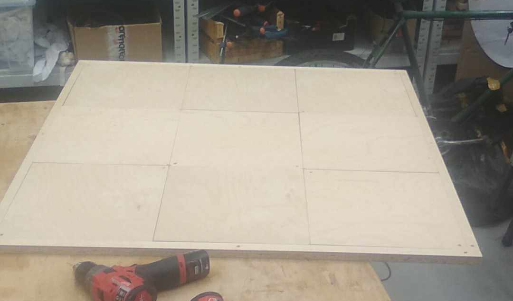

# ESP8266 USB Stepmania Dancepad

This project is adapted from an old project that allows you quite a number of features with just ESP8266EX, which now could be bought for about $1. Unfortunatelly, it uses very antiquated version of the Espressif API, which makes it harder to maintain and change. 

I removed wifi capability, since that's now something I needed, although it could be used to make the Dancepad wireless, but then the USB capability is redundant. 

All interesting things are containted in user/user_main.c, if you want to use more than one dancepads at the same time, it could be easier to change the codes array in that file, it should be also pretty easy to add more buttons, with some additional work add the multiplexing feature to increase the number of buttons beyond 8.



# Quickstart with Docker

See https://github.com/T-vK/docker-esp-sdk
and https://www.youtube.com/watch?v=ntm1iTQdCzE

but TLDR

    ``` bash
    	sudo apt-get install libtool-bin libusb-1.0.0-dev
    	git clone --recursive https://github.com/jasjurk/espusb
	sudo docker pull tavk/esp-sdk:0.1.0
	sudo docker run -t -i -u esp --device=/dev/ttyUSB0 -v /home/$USER$/espusb:/	home/esp/shared_project -e SDK_VERSION='1.5.3' tavk/esp-sdk:0.1.0 make ESP_ROOT=/home/esp/esp-open-sdk burn
    ```

Remember to put your user in $USER$ in commands!

This should flash your ESP8266 with the required code. 

Next, add resistor > 1kom between Vcc and GPIO4, solder Vin(or add your own voltage regulation, but remember that USB gives 5V and ESP8266 needs 3.3V or it burns!!!) to USB connector pin 1, GPIO4 to pin 2, GPIO 5 to pin 3 and GND to pin4.

Next, solder one end of every button to GND, and the other end to GPIO12, GPIO13, GPIO14 and RDX0 respectivelly. 

Unfortunatelly doesn't work on linux systems, probably something about unnecessary USB descriptors, but couldn't be bothered to clean that up right now.

The rest of documentation is from the original project, although it's very helpfull.

# ESP8266 USB Software Driver

I wanted to have USB on the ESP8266, and a while ago I saw on the ESP32 flier, it read: "Rich Peripherals" ... "Sorry, no USB!" I thought to myself, that is ridiculous.  Of course there's USB.

So, it was born.  This is a software USB stack running on the ESP8266/ESP8285.  It requires only one external resistor, between D- and 3.3V.

## Limitations

- You cannot use SDKs newer than 1.5.X. (As of dec-02-2016, 1.5.4 is the latest SDK that has been verified to be compatible.)
- All ESP SDK 2.0 SDKs are incompatible.
- By default, the chip expects D- on GPIO 4 and D+ on GPIO 5 - but any GPIO pair may be used.  It is important to note that both D- and D+ MUST be adjacent.
- This project only operates with low-speed USB (1.5 MBit/s)
  ideal for making peripherals, not for fake network devices and usb-serial bridges.  
  That said - you can still write "control" messages that communicate with the ESP8266.  
  Control messages are a great way to encapsulate your data since they handle all the framing and describing what function you wish to pass data for.

## Resources
- [Getting started guide](https://github.com/cnlohr/espusb/wiki/Getting-Started-Guide)
- [Forum for discussion of development](http://www.esp8266.com/espusb)

## Pre-built binaries

See bottom of this thread: https://github.com/cnlohr/espusb/issues/40#issuecomment-377770936

## Examples

This project contains an example that simulates a usb keyboard and mouse. It also provides a web interface to actually remote control these virtual devices.

## How to use
For a complete guide that includes information on how to install the toolchain or set up a docker container, go here: [Getting started guide](https://github.com/cnlohr/espusb/wiki/Getting-Started-Guide)
If you already have an environment with the toolchain, then here is what you wanna do:

### Software

- Install libusb and recursively clone this repo: 
  
  ``` bash
  sudo apt-get install libusb-1.0-0-dev
  git clone --recursive https://github.com/cnlohr/espusb
  cd espusb
  ```

- `user.cfg` contains some settings that you might have to change to get it working. 

- Building/flashing the main binary
  
  ``` bash
  make ESP_ROOT=~/esp8266/esp-open-sdk/ burn
  ```

- Building/flashing the web interface (for the example mentioned above)
  
  ``` bash
  make ESP_ROOT=~/esp8266/esp-open-sdk/ burnweb
  ```

For more advanced building/flashing methods just run `make` without any parameters.

### Hardware


### Wemos D1 Mini

The Wemos D1 mini is a breadboard friendly ESP board.

You would need to flash the espusb firmware through the USB-serial connection beforehand, and then
wire the GND, 5V, 3.3V, D1, D2 pins to the USB following the wiring instructions. Here is
a picture of a setup with one breadboard:


## Advanced information

### Hardware


NOTE: GPIO12/14 do not need to be connected to ground. GPIO15 may be connected via a pull-down resistor.  For stability, a pull-up on GPIO2 is recommended.

Also, checkout the hardware/ folder.  It has kicad designs for my tiny board.  Though they are for the ESP8285, the same pin configuration may be used to run on the ESP8266.

### Memory Usage

This is typical memory usage for a two-endpoint (in addition to EP0) device.

In summary:

Total SRAM: 232 bytes + Descriptors (~317 bytes)

Total Flash/IRAM (Only iram, tables and usb_init can be stuck in slow flash): 1422 bytes

More details:

SRAM:

```
0000007c D usb_ramtable
0000006c B usb_internal_state
```
IRAM:

You must write: usb_handle_custom_control - the demos here hook it up to the command engine which allows self flashing on 1MB+ parts.

C functions:
```
0000002a T usb_pid_handle_ack
0000014f T usb_pid_handle_data
00000022 T usb_pid_handle_out
000000e9 T usb_pid_handle_in
00000002 T usb_pid_handle_sof
00000039 T usb_pid_handle_setup
```
From/To (in ASM):
```
40100f20 t usb_asm_start
401011ef t usb_asm_end
Total length of ASM: 2cf
```

